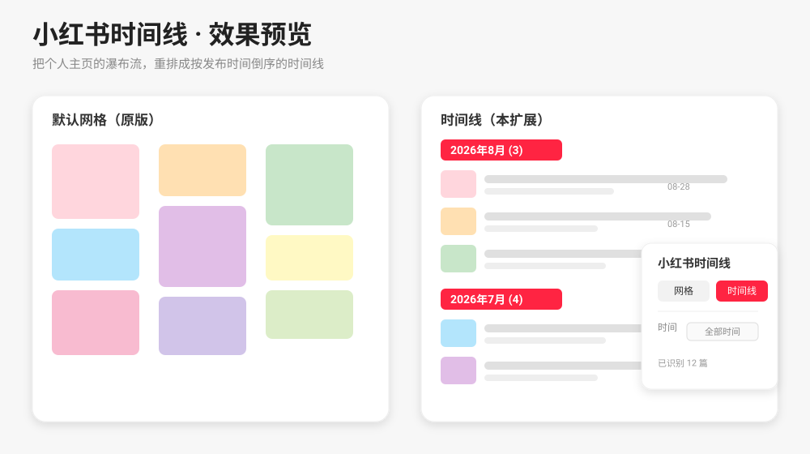

<p align="center">
  
</p>

<h1 align="center">小红书时间线</h1>

<p align="center">
  <strong>把小红书个人主页的笔记，按发布时间重排成时间线。</strong><br />
  <em>Reorganize a Xiaohongshu (RED) profile feed into a chronological timeline — grouped by month, filterable by date.</em>
</p>

<p align="center">
  
  
  
  
</p>

<p align="center">
  
</p>

---

小红书个人主页默认是**瀑布流网格**——笔记按推荐顺序排列，你很难看清「我这一年到底发了什么、节奏如何」。本扩展在**不改动任何数据**的前提下，把主页重排成一条**按发布时间倒序、按月分组**的时间线，并支持时间范围筛选，一眼看清内容脉络。

> 纯本地运行，不请求任何外部接口，不上传任何数据。

## ✨ 功能特性

- **网格 / 时间线 一键切换**：默认保持小红书原版网格；按需切到时间线视图。
- **按月分组的时间线**：按笔记发布时间倒序排列，自动按月切分（如 `2026年8月`、`2026年7月`），一眼看清内容节奏。
- **时间范围筛选**：全部 / 近 3 个月 / 近 6 个月 / 今年 / 自定义起止日期。
- **实时计数浮窗**：右上角浮窗实时显示已识别的笔记数。
- **渐进式加载**：先在网格里自然向下滚动（按小红书原生节奏加载更多），再切时间线，避免漏掉老笔记。
- **原地打开**：点击重排后的卡片，会在当前个人主页内打开原笔记详情，不会跳出主页。
- **零依赖、零上传**：全部在浏览器本地处理，网络请求仅来自小红书页面本身。

## 🚀 快速开始（手动安装）

这是一个未上架 Chrome 应用商店的 MV3 扩展，通过「加载已解压的扩展程序」安装：

1. 克隆或下载本仓库到本地：
   ```bash
   git clone https://github.com/shaozhengmao/xiaohongshu-timeline.git
   ```
2. 打开 Chrome，进入 `chrome://extensions/`。
3. 右上角打开 **开发者模式（Developer mode）**。
4. 点击 **加载已解压的扩展程序（Load unpacked）**。
5. 选择本仓库的**根目录**（即包含 `manifest.json` 的那个文件夹）。
6. 打开任意小红书**个人主页**（`xiaohongshu.com/user/profile/...`），右上角会出现「小红书时间线」浮窗。

## 🔧 工作原理

扩展由两个内容脚本协同完成，互不污染：

| 脚本 | 运行环境 | 职责 |
|------|----------|------|
| `inject.js` | 主线程（`MAIN` world） | 拦截 `fetch` / `XMLHttpRequest`，解析小红书 JSON API 响应；同时读取首屏 SSR 数据。兼容当前个人主页的 `noteCard` 驼峰字段，递归抽取归一化笔记。 |
| `content.js` | 隔离环境（isolated world） | 接收 `inject.js` 通过 `postMessage` 发来的笔记数据，绘制右上角浮窗，并把主页重排为时间线视图。 |

要点：

- **数据补全**：个人主页 SSR 会把部分笔记 ID 脱敏为空，扩展从卡片的 `data-note-id` 与标题反查补回，保证图文与视频都能在时间线中正常打开。
- **不主动抓取**：插件不会单独请求单篇笔记详情；数据全部来自小红书页面本身的首屏与分页加载。
- **路由感知**：监听 `history.pushState` / `popstate`，页面切换时清空缓存、重新识别，避免串号。

## 📁 目录结构

```
xiaohongshu-timeline/
├── manifest.json          # MV3 扩展配置
├── inject.js              # 主线程：拦截 XHS 接口 / SSR，抽取笔记
├── content.js             # 隔离环境：浮窗 + 时间线重排
├── styles.css             # 时间线样式
├── popup.html / popup.js  # 扩展图标点击面板
├── assets/
│   ├── logo.svg
│   └── preview.svg
├── LICENSE
└── README.md
```

## ⏱️ 时间筛选说明

筛选**只作用于已加载的笔记**。要筛到更早的时间区间，请先切回**网格**模式，自然向下滚动把更老的笔记加载进来，再切回时间线并选择对应范围。

时间字段做了多格式兼容：`13 位毫秒戳` / `10 位秒戳` / `YYYY-MM-DD` 字符串 / `MM-DD`（按当年补齐）/ `X天前`，解析失败则归为「未知时间」。

## 🚧 已知限制

- 小红书前端改版频繁，若接口结构或 DOM 类名大幅变化，扩展可能暂时失效，需跟进适配。
- 筛选范围受「已加载笔记」约束（见上文）。
- 「话题」分组视图为**规划中的功能**，当前扩展版本（v0.2.6）仅实装网格 + 时间线 + 时间筛选。

## 🤝 贡献

1. Fork 本仓库并创建分支（`git checkout -b feat/xxx`）。
2. 修改代码，本地用「加载已解压的扩展程序」验证。
3. 提交 Pull Request，并简述改动与验证方式。

## 📄 许可证

[MIT](LICENSE) © 2026 shaozhengmao

## ⚠️ 免责声明

本项目与小红书（RED）官方**无任何关联**，仅为个人学习与研究用途。使用者需自行遵守小红书平台服务条款；因使用本扩展产生的任何风险与后果由使用者自行承担。
